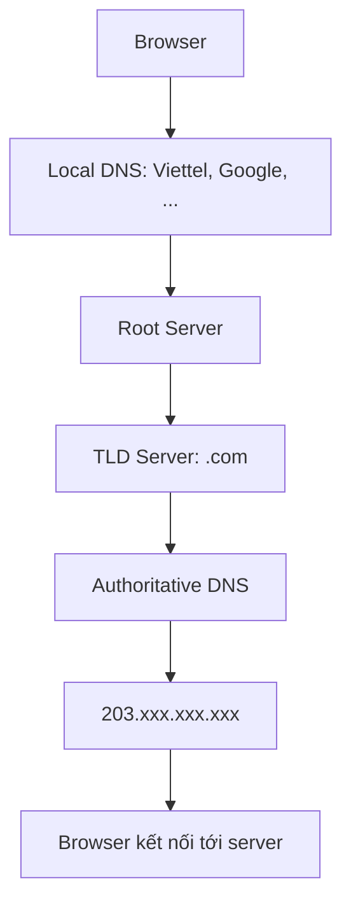
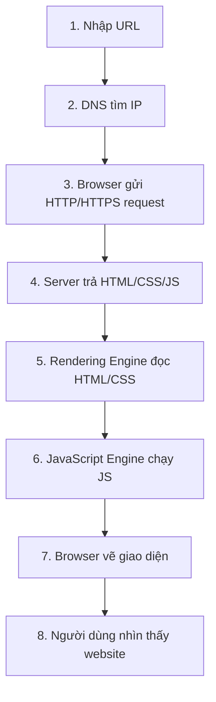

# Backend Introduction

## Checklist

- [x] Internet
- [x] HTTP
- [x] Domain Name
- [x] Hosting
- [x] DNS
- [x] Browser

## Internet

Internet là một mạng lưới toàn cầu gồm các máy tính và thiết bị được kết nối với nhau, sử dụng bộ giao thức TCP/IP để giao tiếp.

Khi người dùng gửi yêu cầu, ví dụ truy cập một website, yêu cầu đó sẽ đi qua nhà cung cấp Internet (ISP), tới máy chủ DNS để chuyển đổi tên miền thành địa chỉ IP. Sau đó, dữ liệu được các router định tuyến qua nhiều mạng khác nhau để đến máy chủ đích.

Cơ chế này cho phép việc giao tiếp trên toàn thế giới diễn ra linh hoạt, phi tập trung và không phụ thuộc vào một hệ thống trung tâm duy nhất.

**ISP** (Internet Service Provider) là nhà cung cấp Internet, ví dụ:

- VNPT
- Viettel
- FPT Telecom

## HTTP

**HTTP** (Hypertext Transfer Protocol) là giao thức truyền tải siêu văn bản trên Web bằng mô hình **Request - Response**.

HTTP định nghĩa các thành phần để browser và server hiểu nhau:

- Cấu trúc request
- Cấu trúc response
- Header
- Status code
- Method: `GET`, `POST`, `PUT`, `DELETE`, ...

HTTP là giao thức **stateless**: mỗi request hoàn toàn độc lập.

Vì vậy, các website thường cần thêm cơ chế lưu trạng thái như:

- Cookie
- Session

HTTP thường được kết hợp với HTTPS để mã hóa dữ liệu.

## Domain Name

**Domain Name** (tên miền) là địa chỉ Internet dễ đọc đối với con người, được chuyển đổi thành địa chỉ IP để máy tính có thể xác định và kết nối đến đúng máy chủ.

Ví dụ, tên miền `example.com` gồm:

- `example`: second-level domain
- `.com`: top-level domain

Tên miền được quản lý và bán bởi các nhà đăng ký tên miền (Registrar). Mục đích chính của tên miền là giúp người dùng truy cập website dễ dàng hơn thay vì phải nhớ các dãy số IP.

Tên miền là duy nhất trên toàn thế giới. ICANN chịu trách nhiệm điều phối hệ thống tên miền toàn cầu.

## Hosting

Hosting cung cấp không gian lưu trữ và tài nguyên máy chủ để chứa website, source code, database và phục vụ website đó cho người dùng trên Internet.

Một số loại hosting phổ biến:

| Loại | Mô tả |
| --- | --- |
| Shared Hosting | Nhiều website dùng chung một server, ít quyền cấu hình. |
| VPS | Server vật lý được chia thành nhiều máy ảo. |
| Dedicated Server | Máy chủ riêng chạy trên một máy tính vật lý. |
| Cloud Hosting | Dịch vụ lưu trữ website và ứng dụng trên mạng lưới máy chủ ảo, ví dụ AWS, Google Cloud. |

## DNS

**DNS** là hệ thống chuyển đổi tên miền dễ đọc đối với con người thành địa chỉ IP mà máy tính hiểu được.

DNS hoạt động theo cấu trúc phân cấp nhiều tầng. Ví dụ khi truy cập:

```text
https://test.gleeze.com
```

Quá trình phân giải DNS:



Trong đó, **Authoritative DNS** là máy chủ DNS chứa thông tin DNS chính thức của một domain.

## Browser

Trình duyệt web đọc và thực thi các thành phần sau để hiển thị trang web cho người dùng:

- HTML: cấu trúc nội dung
- CSS: giao diện, màu sắc
- JavaScript: tương tác, xử lý logic phía client

Browser sử dụng **Rendering Engine** để vẽ giao diện và **JavaScript Engine** để chạy mã JavaScript. Ngoài ra, browser còn cung cấp các tính năng như tab, bookmark, extension và cơ chế bảo mật như sandboxing và HTTPS.

### Rendering Engine

Rendering Engine, ví dụ Blink, Gecko, WebKit, là bộ phận chịu trách nhiệm chuyển HTML và CSS thành giao diện hiển thị trên màn hình.

### JavaScript Engine

JavaScript Engine là thành phần thực thi mã JavaScript trong browser.

### Sandbox

Sandbox là cơ chế cô lập website. Website A không thể tùy ý truy cập:

- File máy tính của bạn
- Dữ liệu website khác
- Cookie của domain khác

Nhờ đó, sandbox giúp tăng tính bảo mật cho người dùng.

## HTTPS

Khi sử dụng HTTPS, browser sẽ:

- Kiểm tra chứng chỉ SSL/TLS, ví dụ Let's Encrypt
- Cảnh báo nếu chứng chỉ lỗi
- Mã hóa dữ liệu truyền đi

Hiện nay, các hệ thống hiện đại dùng **TLS**. SSL đã lỗi thời.

## Toàn bộ quá trình khi mở website


